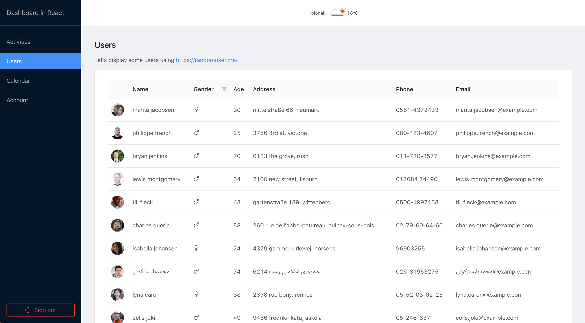

# Boilerplate Series: React x Firebase

> Demo can be found [here](https://reactxfirebase.netlify.com)

## Stack

- React `16.7.0` (create-react-app for configuration)
- Firebase `5.8.1` for auth
- Ant Design `3.13.x` for quick styling

## Next steps

- [ ] Use React hooks
- [ ] Drop recompose
- [ ] Try a different UI library
